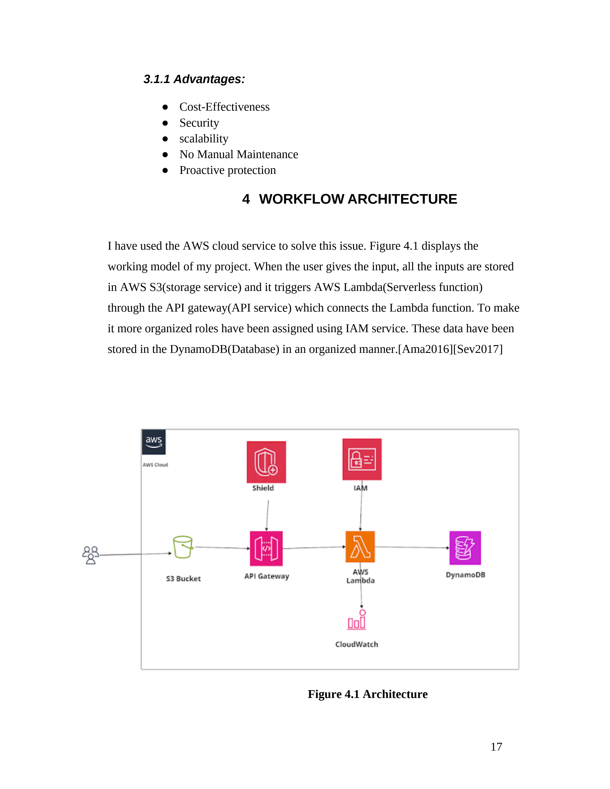
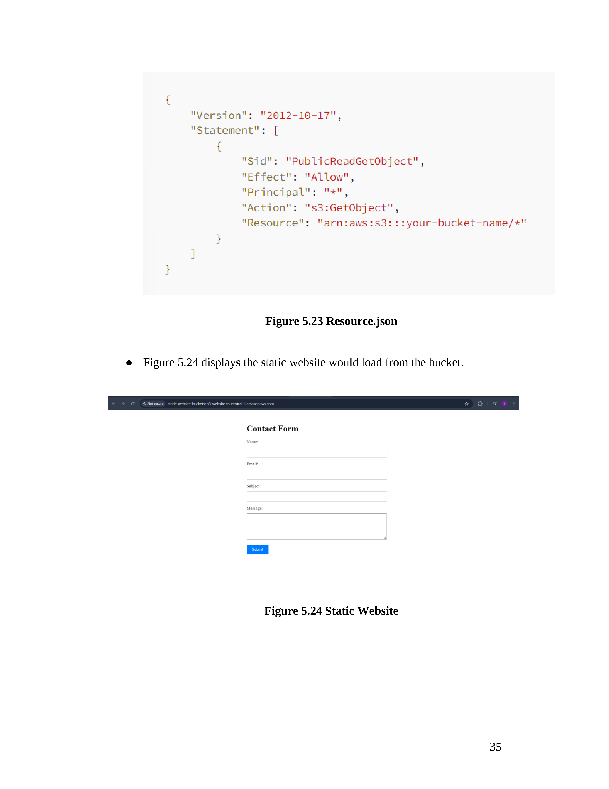
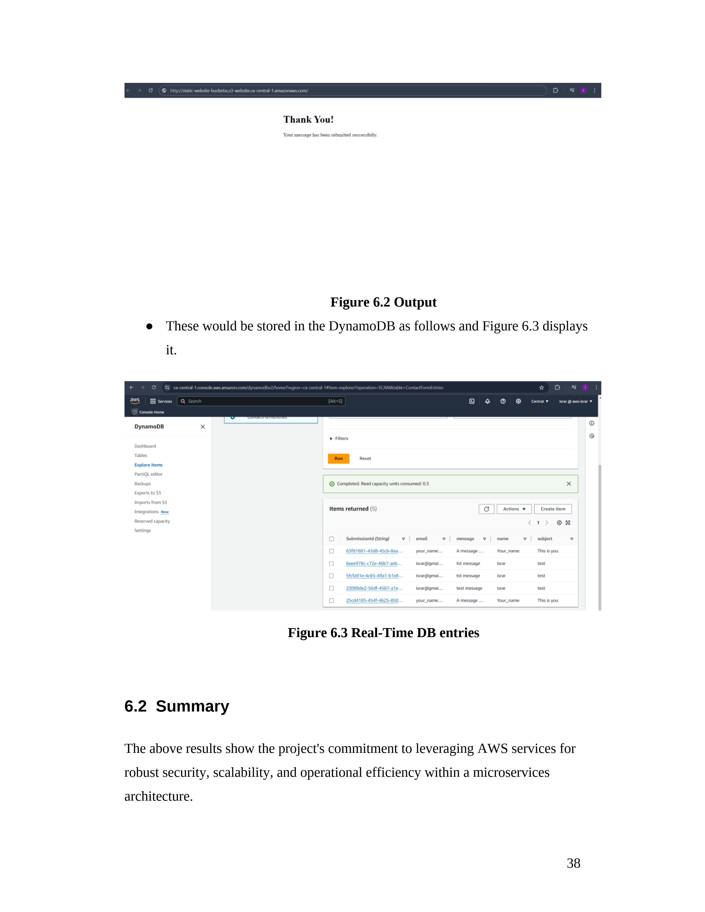

# Securing Serverless Forms
Implementing and Securing serverless contact form in a static website hosting from external attack with AWS services.

<b> ** Feature Highlights ** </b>

<b>Checkout the Architecture:</b>

Want to know how the process is,

1. User fill out the form and submit it, lambda gets activated while user starts filling out.

2. User inputs will be recorded at the backend in dynamoDB and user information will be recorded in S3.

3. Once user's data is processed, thank you page will be displayed in the UI.

Seems like application is based on a server, but how come it's a serverless application?

Lamda is a serverless technology which does not show the underlying server of your application. 
For an instance, you can access application without exposing on which server the application is running. Hence, extruders can't hack the server.

What's the benefit on switching to lambda?

* Hits another layer of security.
* However, the main aspect is cost cutting [serverless is dormant].